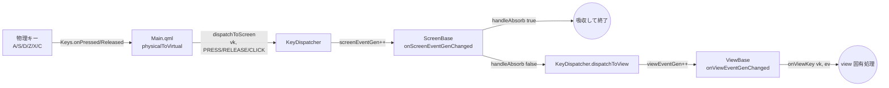
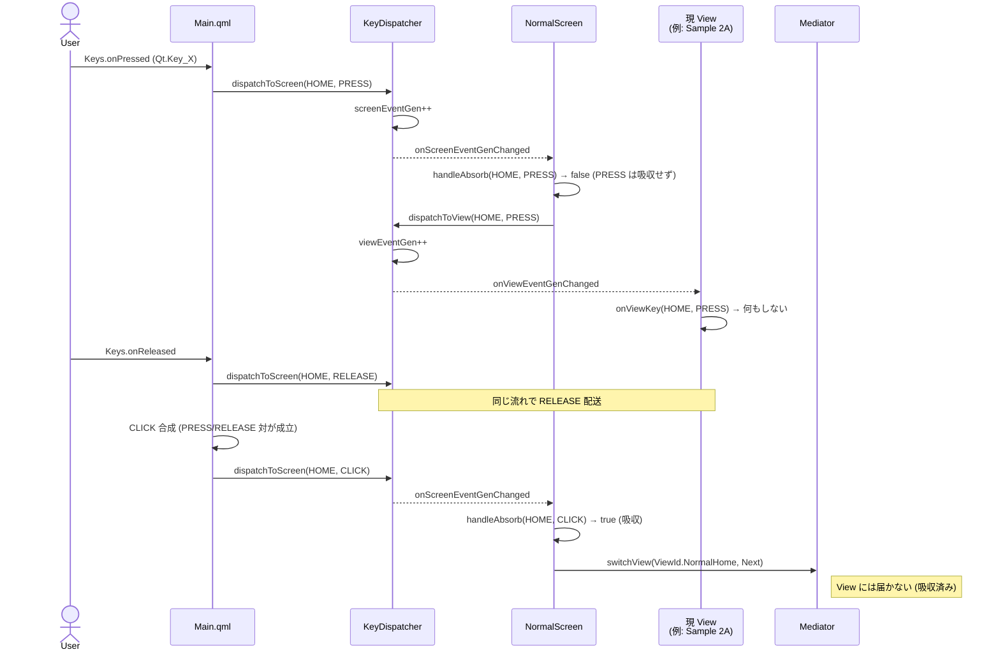
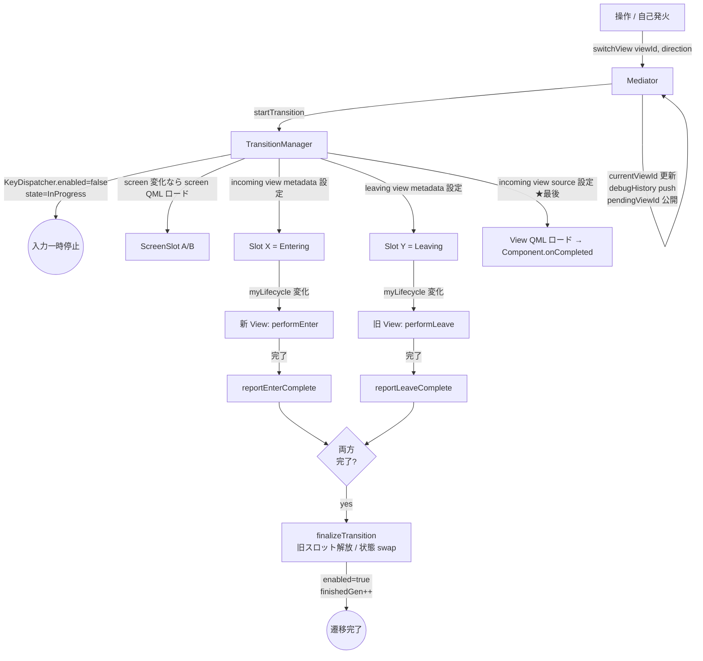
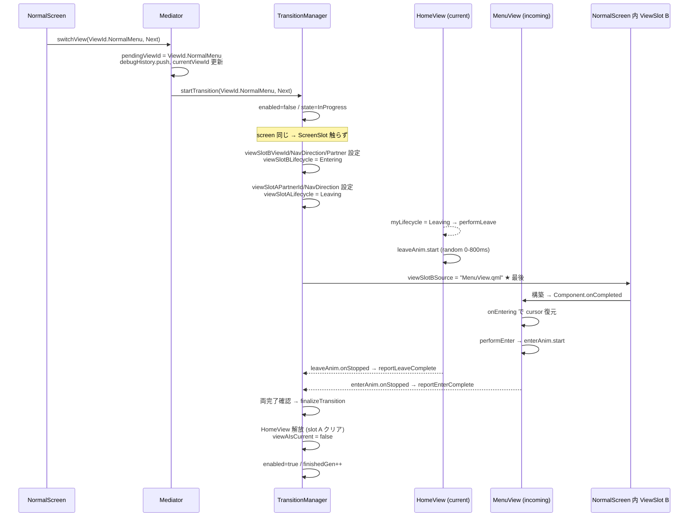
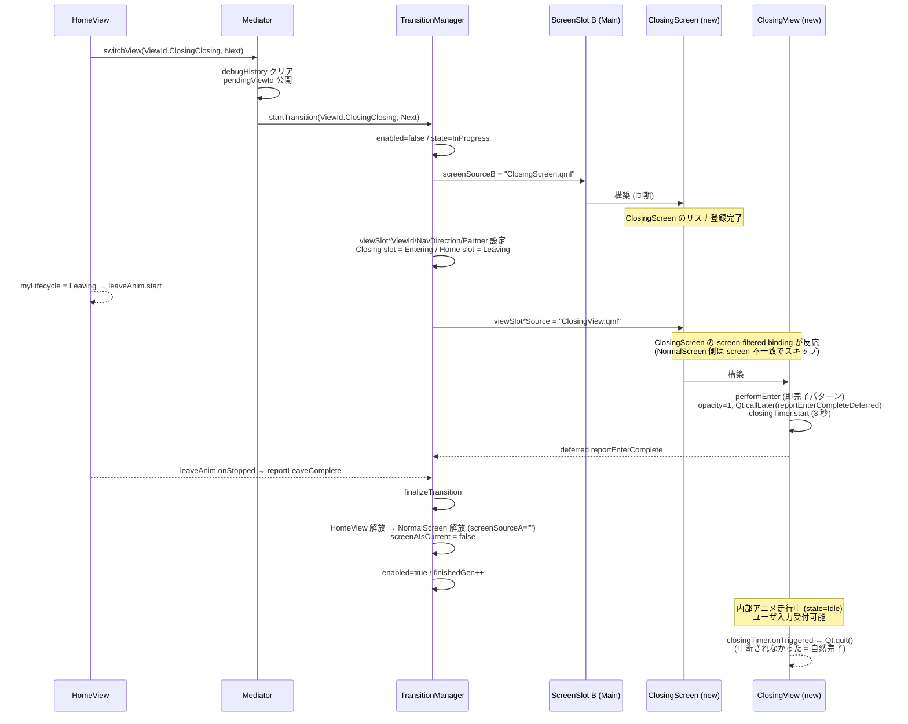
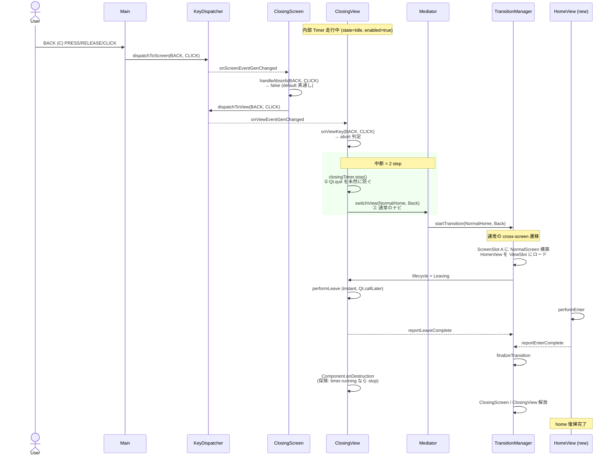
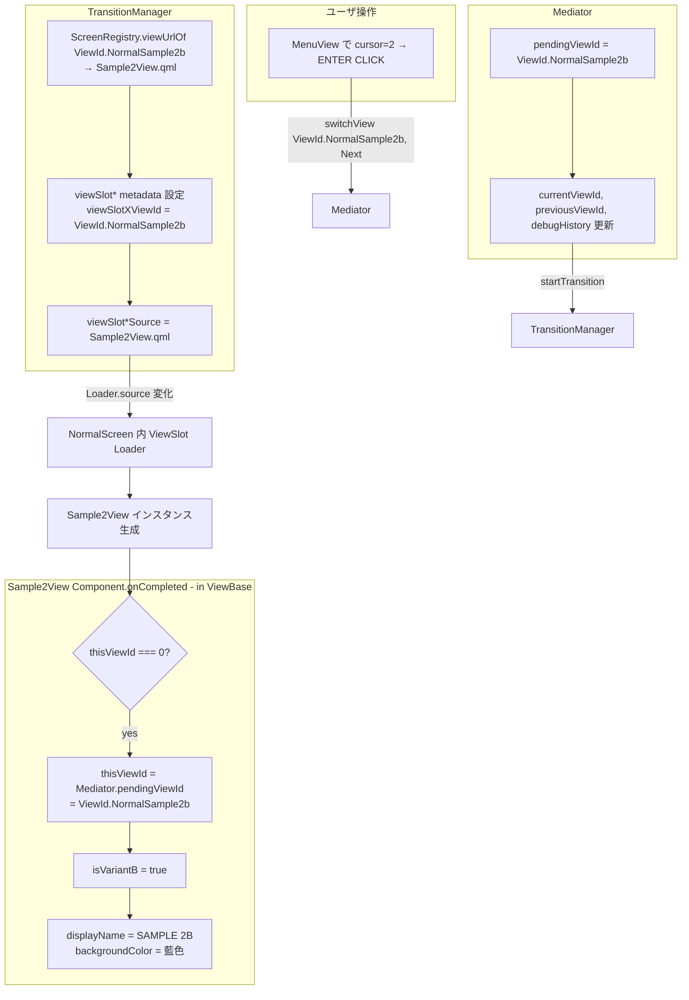
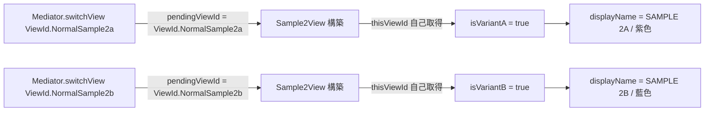
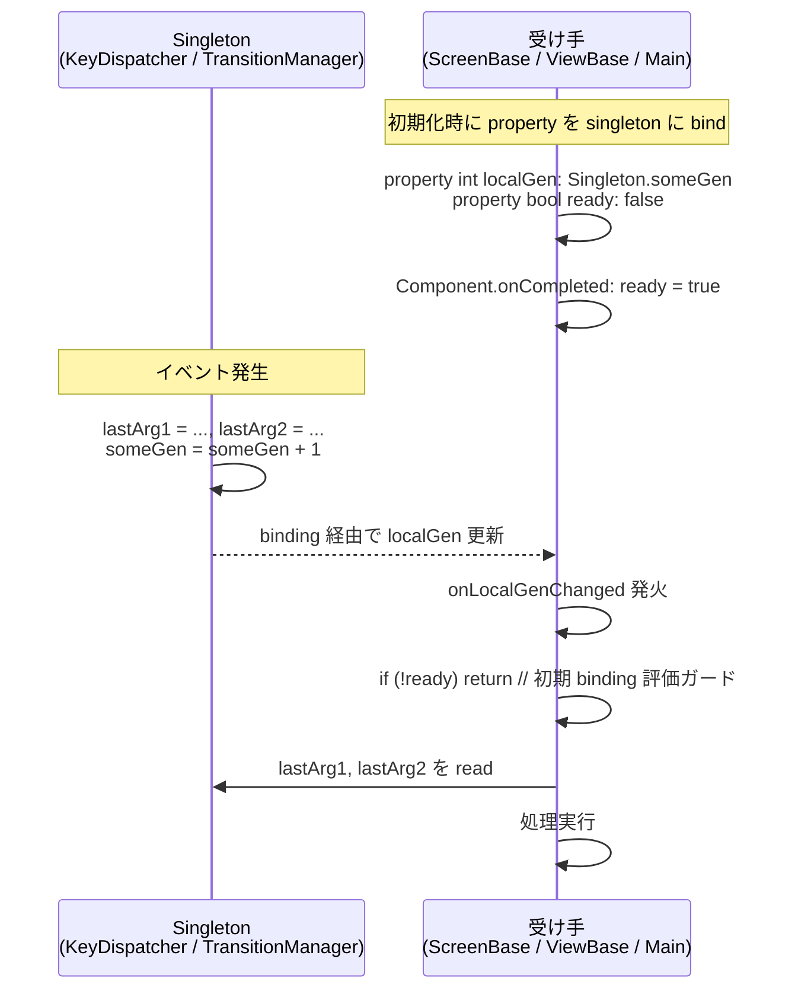
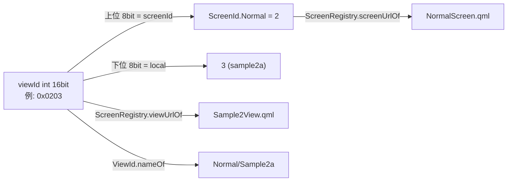

# フロー図集 (mermaid)

このドキュメントは [`design.md`](design.md) の補足。  
画面切り替えと仮想キー通知の流れを mermaid 図で可視化する。  
同じ内容を [`flows.pptx`](flows.pptx) にもまとめてある。

> 表記注: 図中の enum 値は `ViewId.NormalHome` の 2 段形式 (`<Type>.<value>`)。
> QUL 2.x の QML enum 構文に従う (cf. `Loader.Ready`)。詳細は [`design.md`](design.md) §5。

---

## 1. アーキテクチャ俯瞰

主要 singleton と Screen / View の依存関係。

```mermaid
flowchart TB
    subgraph constants[Constants module (enum + helper)]
        SId[ScreenId<br>enum + nameOf]
        VId[ViewId<br>enum + nameOf + screenOf]
        Dir[NavDirection<br>enum + nameOf]
        Lc[ViewLifecycle<br>enum + nameOf]
        VK[VirtualKey<br>enum + nameOf]
        VE[VirtualEvent<br>enum + nameOf]
    end
    subgraph mediator[Mediator module (behavior singletons)]
        Med[Mediator<br>ナビゲーション意図 / 履歴]
        TM[TransitionManager<br>スロット管理 / lifecycle 通知]
        KD[KeyDispatcher<br>仮想キー配送]
        Log[Logger<br>統一ログ]
    end

    Main[Main.qml<br>Window + Keys + ScreenSlot ペア]
    SR[ScreenRegistry<br>screenUrlOf / viewUrlOf<br>(qrc URL マップ)]
    SB[ScreenBase<br>ViewSlot ペア + 入力吸収]
    VB[ViewBase<br>lifecycle 契約 + フック]

    ScreenI[OpeningScreen / NormalScreen / ClosingScreen]
    ViewI[OpeningView / HomeView / MenuView /<br>Sample1View / Sample2View / ClosingView]

    Main -->|key 変換| KD
    Main -->|kickoff: switchView| Med
    Main -->|ScreenSlot bind| TM
    Main -->|DI: screenRegistry =| TM

    SB -->|screenEventGen bind| KD
    SB -->|screen フィルタ binding| TM
    SB -->|screenOf| VId

    VB -->|viewEventGen bind| KD
    VB -->|lifecycle bind| TM
    VB -->|pendingViewId 取得| Med
    VB -->|nameOf| VId

    ScreenI -.派生.-> SB
    ViewI -.派生.-> VB

    Med -->|startTransition| TM
    TM -->|screenUrlOf / viewUrlOf| SR
    SR -.データ参照.-> SId
    SR -.データ参照.-> VId
    TM -->|enabled toggle| KD
```

---

## 2. 仮想キー通知の流れ (全体像)

物理キー → 仮想キー → Screen → View の 2 段配送。



---

## 3. 仮想キー通知 シーケンス: HOME (X) で normal/home へ

NormalScreen が HOME CLICK を吸収する例。



---

## 4. 画面切替 概観: Mediator → TransitionManager → Views



---

## 5. 同シーン内遷移 シーケンス: home → menu

`MENU` 吸収後の流れ。



---

## 6. シーン跨ぎ遷移 シーケンス: home → closing

新シーン QML のロード + view 切替が並走する。



---

## 7. Closing 中断シーケンス: BACK CLICK で home へ復帰

ClosingView 自身が `onViewKey` で BACK/HOME を受信し、内部 Timer を止めて通常の `switchView` を発火する。Mediator / TransitionManager / ClosingScreen 側に中断専用 API は持たない（`closingAborted` フラグも `forceUnloadCurrentView` も不要）。



---

## 8. 同一 QML 多重 ID パターン: Sample2View が a/b 両対応

`Mediator.pendingViewId` 経由で `thisViewId` を動的取得する仕組み。



別途、Sample2View が sample2a 用にロードされた場合:



---

## 9. property-token 通知パターン (signal の代替)

QUL では `Connections { target: singleton }` を避けるため、singleton 側で **世代カウンタを incr**、受け手がローカル binding + `on*Changed` + `ready` ガードで監視する。



採用ケース:
- `KeyDispatcher.screenEventGen` / `viewEventGen` → ScreenBase / ViewBase が監視
- `TransitionManager.finishedGen` / `lastFinishedViewId` → Main.qml が監視

---

## 10. ID 表現と整数化

ビュー ID は **bit-packed 整数**で管理:



ID 一覧 (`ViewId.qml` 内の `enum ViewId`、QUL 2.9 の QML enum 構文)。アクセスは `<TypeName>.<EnumName>.<Value>` の 3 段:

| ID 定数 (使う側の表記) | hex 値 | 担当 QML |
| --- | --- | --- |
| `ViewId.ViewId.OpeningOpening` | `0x0100` | OpeningView.qml |
| `ViewId.ViewId.NormalHome`     | `0x0200` | HomeView.qml |
| `ViewId.ViewId.NormalMenu`     | `0x0201` | MenuView.qml |
| `ViewId.ViewId.NormalSample1`  | `0x0202` | Sample1View.qml |
| `ViewId.ViewId.NormalSample2a` | `0x0203` | **Sam