# フロー図集 (mermaid)

このドキュメントは [`design.md`](design.md) の補足。  
画面切り替えと仮想キー通知の流れを mermaid 図で可視化する。  
同じ内容を [`flows.pptx`](flows.pptx) にもまとめてある。

> 表記注: 図中では可読性のため enum 値を `ViewId.NormalHome` のように短縮表記する。  
> 実 QML での正式な書き方は `ViewId.ViewId.NormalHome` (`<TypeName>.<EnumName>.<Value>` の 3 段、QUL 2.9 の QML enum 構文)。詳細は §10。

---

## 1. アーキテクチャ俯瞰

主要 singleton と Scene / View の依存関係。

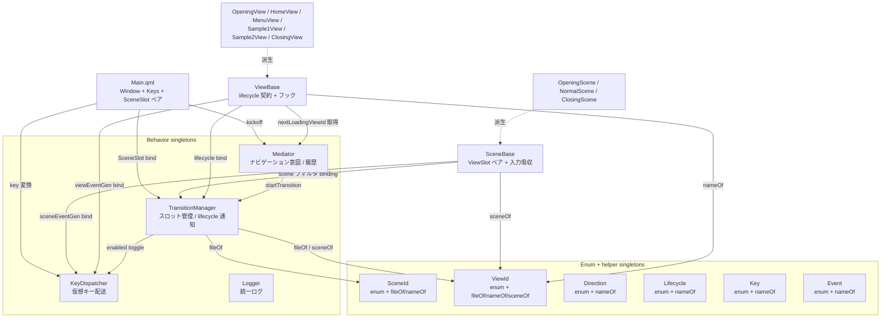

---

## 2. 仮想キー通知の流れ (全体像)

物理キー → 仮想キー → Scene → View の 2 段配送。

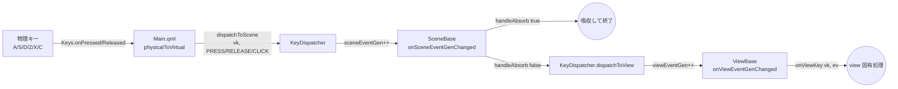

---

## 3. 仮想キー通知 シーケンス: HOME (X) で normal/home へ

NormalScene が HOME CLICK を吸収する例。

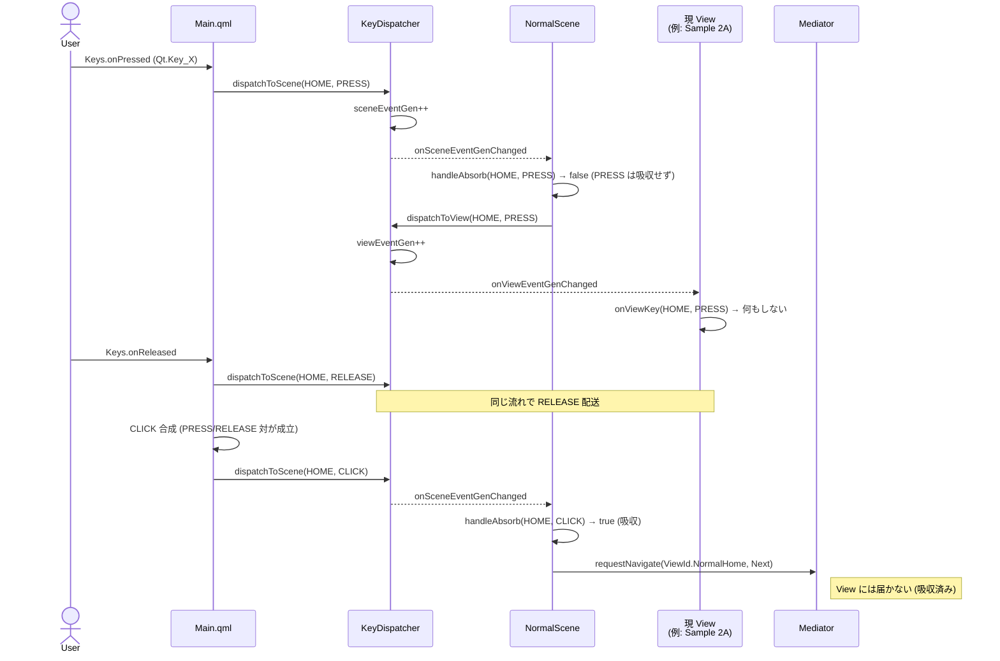

---

## 4. 画面切替 概観: Mediator → TransitionManager → Views

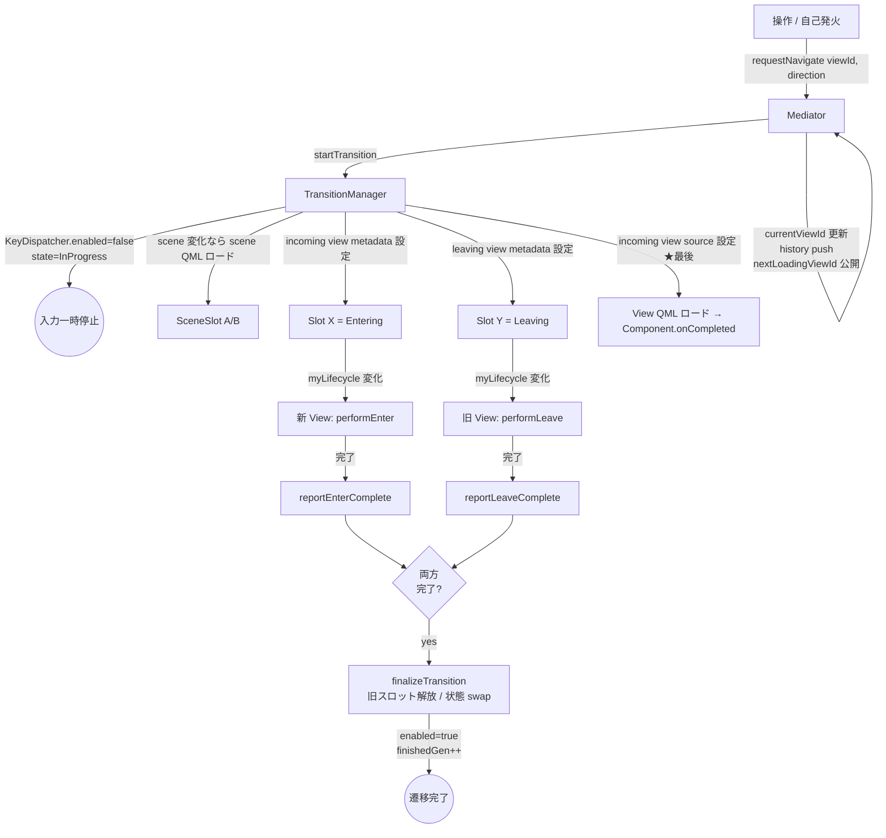

---

## 5. 同シーン内遷移 シーケンス: home → menu

`MENU` 吸収後の流れ。

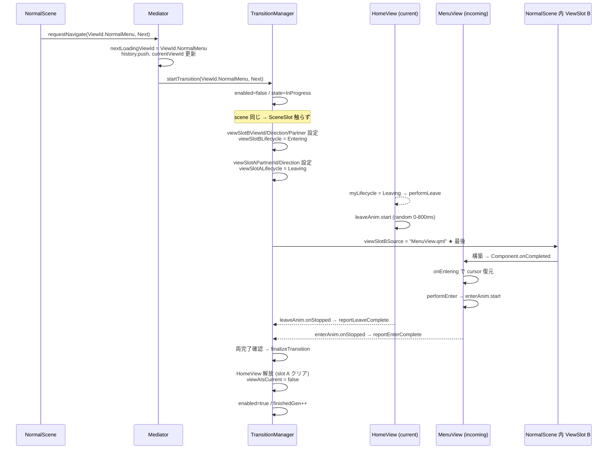

---

## 6. シーン跨ぎ遷移 シーケンス: home → closing

新シーン QML のロード + view 切替が並走する。

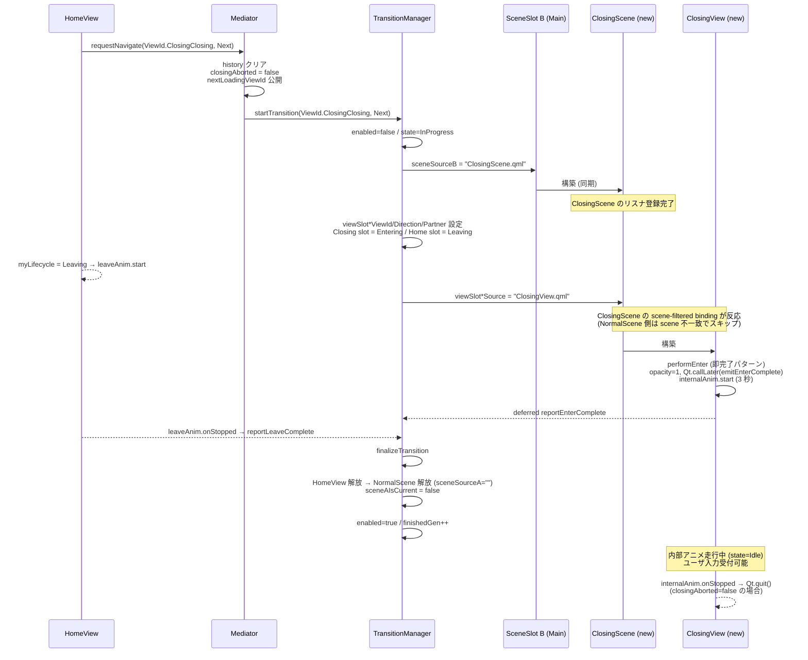

---

## 7. Closing 中断シーケンス: BACK CLICK で home へ復帰

`Mediator.closingAborted` フラグと `forceUnloadCurrentView` の組み合わせ。

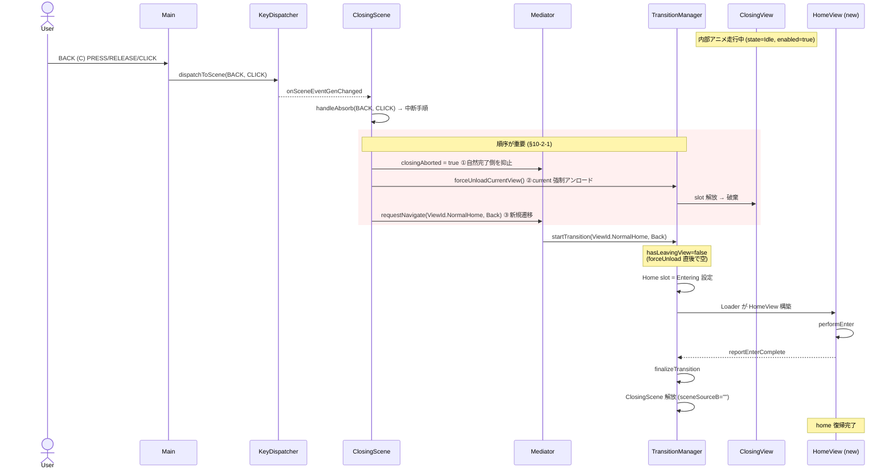

---

## 8. 同一 QML 多重 ID パターン: Sample2View が a/b 両対応

`Mediator.nextLoadingViewId` 経由で `thisViewId` を動的取得する仕組み。

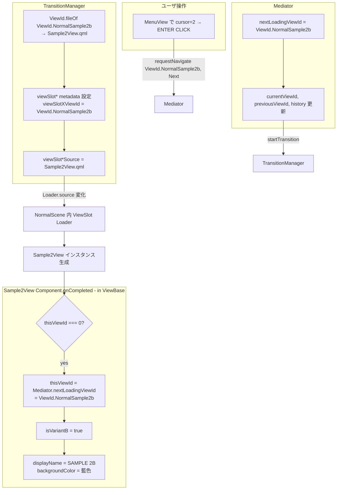

別途、Sample2View が sample2a 用にロードされた場合:

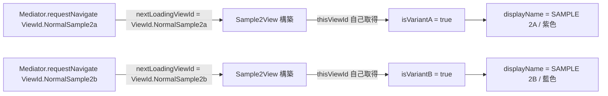

---

## 9. property-token 通知パターン (signal の代替)

QUL では `Connections { target: singleton }` を避けるため、singleton 側で **世代カウンタを incr**、受け手がローカル binding + `on*Changed` + `ready` ガードで監視する。

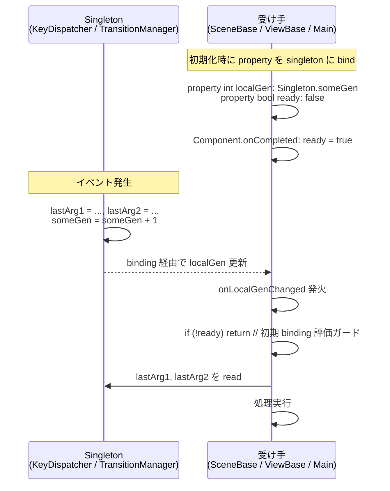

採用ケース:
- `KeyDispatcher.sceneEventGen` / `viewEventGen` → SceneBase / ViewBase が監視
- `TransitionManager.finishedGen` / `lastFinishedViewId` → Main.qml が監視

---

## 10. ID 表現と整数化

ビュー ID は **bit-packed 整数**で管理:

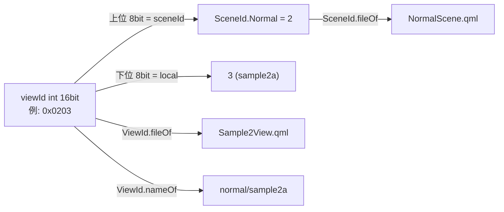

ID 一覧 (`ViewId.qml` 内の `enum ViewId`、QUL 2.9 の QML enum 構文)。アクセスは `<TypeName>.<EnumName>.<Value>` の 3 段:

| ID 定数 (使う側の表記) | hex 値 | 担当 QML |
| --- | --- | --- |
| `ViewId.ViewId.OpeningOpening` | `0x0100` | OpeningView.qml |
| `ViewId.ViewId.NormalHome`     | `0x0200` | HomeView.qml |
| `ViewId.ViewId.NormalMenu`     | `0x0201` | MenuView.qml |
| `ViewId.ViewId.NormalSample1`  | `0x0202` | Sample1View.qml |
| `ViewId.ViewId.NormalSample2a` | `0x0203` | **Sample2View.qml** |
| `ViewId.ViewId.NormalSample2b` | `0x0204` | **Sample2View.qml** (同 QML) |
| `ViewId.ViewId.ClosingClosing` | `0x0300` | ClosingView.qml |

---

## 関連ドキュメント

- [design.md](design.md) — 設計の根拠と詳細
- [README.md](../README.md) — ビルド/動作確認の手順
- [flows.pptx](flows.pptx) — 同内容のスライドショー
